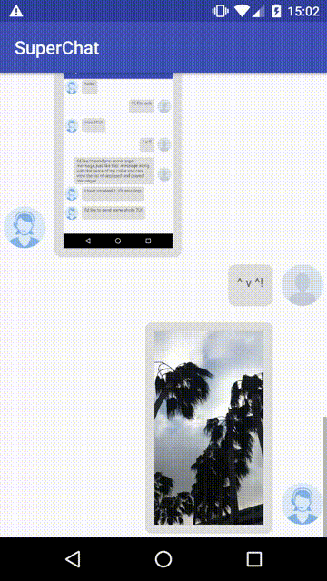
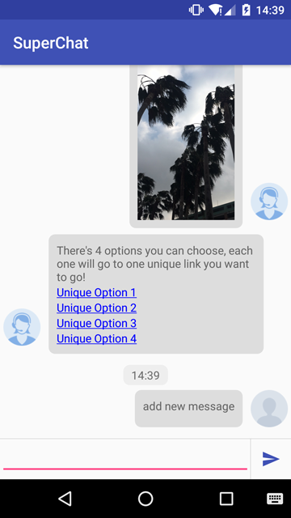

SuperChat
===========

SuperChat is a library to easily create chat, message, feedback activity.


&nbsp;



Usage
-----

###### Layout:
```xml
    <cn.yueying0083.superchat.view.ChatListView
        android:id="@+id/clv"
        android:layout_width="match_parent"
        android:layout_height="0dip"
        android:layout_weight="1"
        android:divider="@android:color/transparent"
        android:listSelector="@android:color/transparent" />
```

###### Activity:
```java
    List<BaseMessage> messageList = new ArrayList<>();
    ...
    //assemble list
    ...
    chatListView.updateList(messageList);
```

###### Model:
```java
    public abstract class BaseMessage {

        public enum ChatType {
            LEFT, RIGHT
        }

        int id;
        long chatDateTime;// mills
        String avatarUri;

        /**
         * Type of chat, left or right
         *
         * @return
         */
        public abstract ChatType getChatType();

        /**
         * Custom view to use in chat content
         *
         * @return
         */
        public abstract View getChatContentView(@NonNull Context context);
    }
```

Avatar
------
You must provide an ImageLoader to ChatView, otherwise it will show default avatar or no avatar for null.<br/>
You may use other 3rd party tools like [Picanoo](http://square.github.io/picasso/)
```java
chatListView.setImageLoader(mImageDisplay);
```

Timeline
--------

Time line consider to be message's label, TimelineFormatter give you an implementation whether the timeline should be shown, how to show it.
```java
    chatListView.setTimelineFormatter(new TimelineFormatter(){
         @Override
        public String format(long current, long prev) {
            return null;
        }
    });
```

Click Event
-----------
```java
    chatListView.setOnMessageClickListener(new ChatListView.OnMessageClickListener() {
        @Override
        public void onClick(int id) {
            switch (id){
                case xxx:
                    ....
                    break;
            }
        }
    });
```

Prev Load
---------
```xml
    <cn.yueying0083.superchat.view.ChatListView
        app:clv_count_each_time="10"        <!-- count of message prev load every time -->
                                            <!-- less than this will be consider there is no more message -->
        app:clv_enable_load_prev="true"    <!-- if prev load enable -->
        />
```
```java
    chatListView.setPrevMessageLoader(new ChatListView.PrevMessageLoader() {
          @Override
          public List<BaseMessage> getPrevMessage() {
                return null;// set your prev message data here
          });
```

Component
=========
For now, SuperChat is providing 3 components to you. Each component has two subclass, left and right.

TextMessage
-----------
TextMessage is simple, do not need anything to provide.

```java
    TextMessage tm = new LeftTextMessage("hello!", time);
```

ImageMessage
------------
ImageMessage need you to provide a ImageLoader to load image.<br/>
Same thing to do as avatar.
```java
    ImageMessage im = new LeftImageMessage("file:///android_asset/screen_shot_1.png", time, new ImageLoader(){

        @Override
        public void loadImage(ImageView iv, String uri) {
            // load your image into imageview;
            //
        }
    }, "file:///android_asset/left.png");
```

LinkMessage
-----------
LinkMessage allow you to create rich TextMessage, add links to options
```java
    messageList.add(new LinkMessage.LeftLinkMessage("There's 4 options you can choose, each one will go to one unique link you want to go!", 1491025641430L
                    , "file:///android_asset/left.png", new LinkMessage.Link("Unique Option 1"), new LinkMessage.Link("Unique Option 2")
                    , new LinkMessage.Link("Unique Option 3"), new LinkMessage.Link("Unique Option 4")));
```

# To be continue
- More Components: ~~LinkMessage~~, FeedbackMessage, MusicMessage...
- ~~Input area~~.
- ~~Clickable~~.
- Message loadable: send message progress.